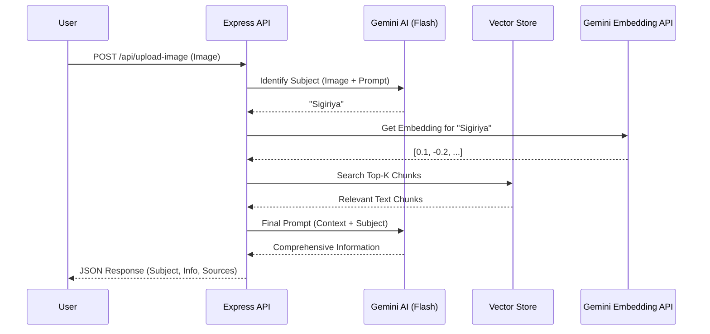
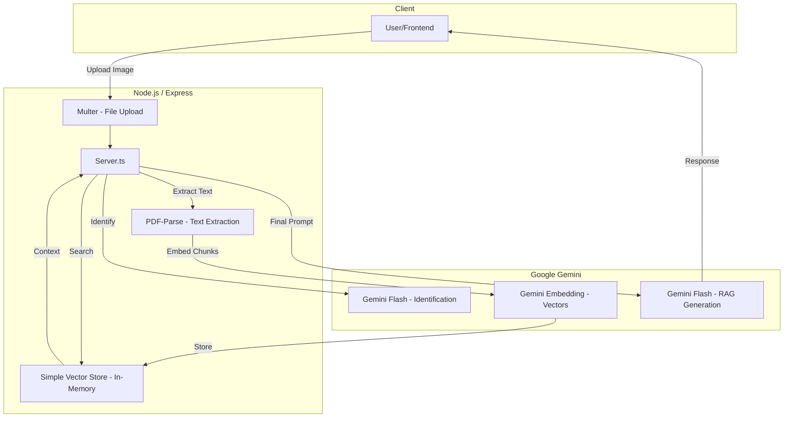

# Image-to-RAG Backend Manual

This guide provides instructions on how to set up, run, and interact with the Image-to-RAG Backend on your local machine.

## 1. Prerequisites

- **Node.js**: Version 22.x or higher.
- **npm**: Usually comes with Node.js.
- **Gemini API Key**: Obtain one from the [Google AI Studio](https://aistudio.google.com/app/apikey).

## 2. Local Setup

1. **Clone or Download the Project**:
   Ensure all files (`server.ts`, `package.json`, `tsconfig.json`, etc.) are in a single directory.

2. **Install Dependencies**:
   Open your terminal in the project root and run:
   ```bash
   npm install
   ```

3. **Configure Environment Variables**:
   Create a `.env` file in the root directory and add your Gemini API key:
   ```env
   GEMINI_API_KEY=your_api_key_here
   ```

4. **Prepare Directories**:
   Create the following folders if they don't exist:
   ```bash
   mkdir uploads
   mkdir temp
   ```

5. **Add Documents**:
   Place your `.pdf` files into the `uploads/` directory. These will be indexed automatically when the server starts.

## 3. Running the Application

To start the server in development mode:
```bash
npm run dev
```
The server will start at `http://localhost:3000`.

---

# API Documentation

## Base URL
`http://localhost:3000`

## Endpoints

### 1. Upload Image & Get Info (RAG)
Identifies the subject in an image and retrieves relevant information from indexed PDFs.

- **URL**: `/api/upload-image`
- **Method**: `POST`
- **Content-Type**: `multipart/form-data`
- **Body**:
  - `image`: (File) The image to identify.
- **Success Response**:
  - **Code**: 200
  - **Content**:
    ```json
    {
      "subject": "Sigiriya Rock Fortress",
      "information": "Detailed text from LLM based on PDF context...",
      "sources": ["sigiriya.pdf"]
    }
    ```

### 2. Chat with Documents
Ask questions about the content of your uploaded PDF documents.

- **URL**: `/api/chat`
- **Method**: `POST`
- **Content-Type**: `application/json`
- **Body**:
  ```json
  {
    "message": "Who built Sigiriya?"
  }
  ```
- **Success Response**:
  - **Code**: 200
  - **Content**:
    ```json
    {
      "answer": "King Kashyapa built Sigiriya...",
      "sources": ["sigiriya.pdf"]
    }
    ```

### 3. Re-index Documents
Triggers a fresh scan and indexing of the `uploads/` directory.

- **URL**: `/api/reindex`
- **Method**: `POST`
- **Success Response**:
  - **Code**: 200
  - **Content**: `{ "message": "Re-indexing triggered successfully" }`

---

# System Architecture

## Overview
The system follows a Retrieval-Augmented Generation (RAG) architecture. It combines computer vision (via Gemini) with semantic search to provide grounded answers.

## Architecture Diagram (Mermaid UML)

### Sequence Diagram: Image-to-RAG Flow


### Component Diagram


## Data Flow
1. **Indexing Phase**: On startup, PDFs are read -> split into chunks -> converted to vectors -> stored in memory.
2. **Identification Phase**: User uploads image -> Gemini identifies the subject.
3. **Retrieval Phase**: Subject string is embedded -> Vector Store finds closest document chunks.
4. **Generation Phase**: Context + Subject are sent to Gemini -> Final helpful response is generated.
